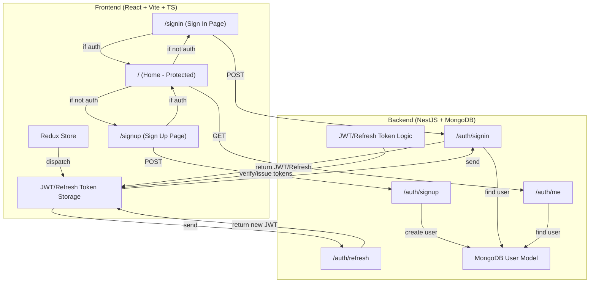

# Common Auth System

A full-stack authentication system using **React (Vite + TypeScript)** for the frontend and **NestJS + MongoDB** for the backend. It features JWT authentication, refresh tokens, protected and public routes, and Redux for state management.

---

## 🛠️ Tech Stack

- **Frontend:** React, Vite, TypeScript, Redux Toolkit, React Router
- **Backend:** NestJS, MongoDB, Mongoose, Passport, JWT

---

## 📁 Project Structure

```
common-auth/
├── front-end/   # React + Vite + TS (client)
├── back-end/    # NestJS + MongoDB (server)
└── README.md    # Project documentation
```

### Frontend Structure

```
front-end/
├── src/
│   ├── pages/      # SignIn, SignUp, Home
│   ├── store/      # Redux store and slices
│   ├── App.tsx     # Routing and protection
│   └── ...
```

### Backend Structure

```
back-end/
├── src/
│   ├── auth/       # Auth module, controller, service, guards, strategies
│   ├── user/       # User module, schema, service
│   ├── app.module.ts
│   └── ...
```

---

## 🔒 Features

- **JWT Authentication** (access & refresh tokens)
- **Auto-refresh** of tokens and auto sign-out on expiry
- **Protected routes** (Home) and **public routes** (SignIn, SignUp)
- **Redux** for global auth state and persistence
- **NestJS global JWT guard** (all routes protected by default, use `@Public()` for open routes)

---

## 🚀 How to Use

### 1. Clone and Install
```sh
# In project root
git clone <repo-url> common-auth
cd common-auth

# Install backend dependencies
cd back-end
npm install

# Install frontend dependencies
cd ../front-end
npm install
```

### 2. Start MongoDB
Make sure MongoDB is running locally (default: `mongodb://localhost/common-auth`).

### 3. Start Backend
```sh
cd back-end
npm run start:dev
```

### 4. Start Frontend
```sh
cd front-end
npm run dev
```

### 5. Open in Browser
Go to [http://localhost:5173](http://localhost:5173)

---

## 🏗️ Auth Flow

- **Sign Up:** Create a new user (public route)
- **Sign In:** Get JWT and refresh token (public route)
- **Home:** Protected, only for authenticated users
- **Sign Out:** Clears tokens and redirects to Sign In
- **Token Refresh:** Handled automatically before expiry

---

## 🖼️ Architecture Diagram



---

## 📢 Notes
- Use `@Public()` on any backend route you want to be accessible without authentication.
- All other routes are protected by JWT by default.
- For production, restrict CORS and use environment variables for secrets. 